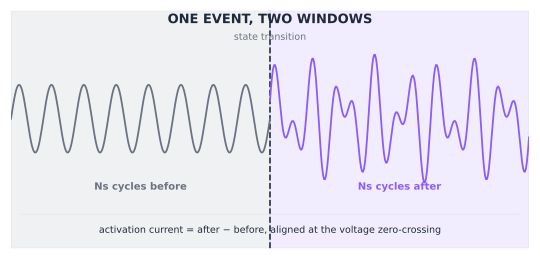
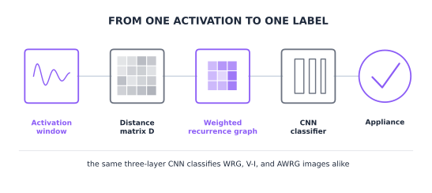

A 60-watt bulb switches on next to a warehouse's compressor motor. On its
own, a bulb's current is about the simplest signature in NILM: a smooth,
resistive sine wave, barely worth building a classifier for. Wired to one
leg of the same three-phase line as that motor, the bulb's voltage-current
trajectory comes out looking almost unrecognizable, twisted by the current
the motor's other two phases pull just to keep turning. Same bulb, same
physics, but the feature a classifier sees depends entirely on what else is
running on the line.

Chapter 1 left one question open: how do you turn a raw switch-on event,
whether it's a bulb's current spike or a motor's distorted three-phase draw,
into a feature specific enough to tell one appliance from another? This
chapter builds that feature once, then shows it survives both the clean
residential case and the messy industrial one.

## Getting one activation window

Every feature in this chapter starts from the same raw material: a short
window of current and voltage, centered on the moment an appliance changed
state. Getting that window right matters as much as anything downstream of
it. The recipe, unchanged across the WRG, AWRG, and phase-imbalance work,
is to measure $N_s$ complete mains cycles immediately before the
transition, $\{\mathbf{i}^{(b)}, \mathbf{v}^{(b)}\}$, and $N_s$ cycles
immediately after, $\{\mathbf{i}^{(a)}, \mathbf{v}^{(a)}\}$
[@faustine2020wrg]. For three-phase industrial data each phase gets its own
before-and-after pair; for single-phase residential data there is only one
[@faustine2021awrg].

Both windows are aligned at the voltage's zero-crossing before anything else
happens to them, and that alignment is not a formality. An AC waveform's
instantaneous value depends on exactly where in the cycle it is sampled, so
comparing a before-window and an after-window that start at different phase
angles would pick up a difference caused by phase misalignment, not by the
appliance. Zero-crossing alignment pins both windows to the same starting
phase, so a point-by-point subtraction reflects only what actually changed.
Because current also adds linearly, that subtraction is enough on its own to
cancel out everything that did not change and leave only the appliance that
just switched: $\mathbf{i} = \mathbf{i}^{(a)} - \mathbf{i}^{(b)}$ for a
switch-on event, or the reverse for a switch-off [@faustine2020wrg;
@faustine2021awrg]. $N_s$ itself is not universal: 20 cycles for the
sub-metered single-appliance data the original WRG paper used, 2 cycles for
aggregated PLAID (following the convention in
[@debaets2018energybuildings]), and 10 to 25 cycles for the three-phase
LILACD data, chosen empirically once the industrial signal turned out to
need a longer window to settle [@faustine2020wrg; @faustine2021awrg;
@faustine2023ftnilm].

The resulting window is still $T_s = f_s / f$ samples long, tens of
thousands of samples at PLAID's 30 kHz. Piecewise Aggregate Approximation
(PAA) reduces it to a fixed, much smaller size $w$ by averaging each of $w$
equal segments down to one value, which is what actually feeds the distance
matrix below. @fig-activation-extraction walks through the extraction step;
@fig-wrg-pipeline picks up immediately after, once that fixed-size window
exists.

::: {layout-ncol="2"}
{#fig-activation-extraction}

{#fig-wrg-pipeline}
:::

::: {.ark-concept}
<i class="bi bi-info-circle-fill"></i> Key Concept

Take that activation current, reduced to $w$ points
$\mathbf{x} = \{x_1, \ldots, x_w\}$. The distance similarity matrix
$D_{w \times w} = [d_{k,j}]$ records how far apart every pair of points in
that window is:

$$
d_{k,j} = |x_k - x_j|
$$

$D$ says nothing about appliances by itself. It is a structural fingerprint
of the waveform's own shape: a smooth periodic signal produces one pattern,
a spiky transient produces another. The rest of this chapter is about what
to do with $D$ once it exists [@faustine2020wrg].
:::

The notebook below builds $D$ for a single, real activation current from
PLAID, already extracted the way @fig-activation-extraction describes. The
same event can be read two ways at once: current against time, on the left,
or current against voltage, on the right.




## The other route: the V-I trajectory

Chapter 1 named the voltage-current (V-I) trajectory as a high-frequency
signature: the closed loop traced by plotting instantaneous voltage against
instantaneous current over one cycle. The right-hand panel above, the same
activation current plotted against its own voltage instead of against time,
is that loop.

A resistive appliance traces something close to a straight line; a motor or
a switch-mode power supply bends that line into a loop with a distinctive
shape. That shape is a real, usable feature on its own, and it is the one
most of the appliance-classification literature reached for first
[@debaets2018smartcomp; @debaets2018energybuildings]. To make it a fixed-size
input a classifier can consume, the loop is meshed onto a $w \times w$ grid
and rasterized into a binary V-I image, the same way a raw current window
gets reduced to $D$ above. That V-I image is the baseline this chapter
measures WRG against for the rest of the way.

## From a distance matrix to a recurrence graph

The standard way to turn $D$ into an image, borrowed from nonlinear
time-series analysis, is the recurrence plot: pick a threshold $\epsilon$ and
mark two points as "recurring" whenever they are closer than that threshold
[@marwan2007recurrence]. Formally, the recurrence graph $RG_{w \times w} =
[r_{k,j}]$ is the binary matrix

$$
r_{k,j} = \begin{cases} 1 & \text{if } d_{k,j} \geq \epsilon \\ 0 & \text{otherwise} \end{cases}
$$

$RG$ can be read as an unweighted graph: $r_{k,j}$ is the adjacency matrix
between points in time, and the resulting image gives a classifier something
to learn from beyond the raw waveform [@faustine2020wrg]. But binarizing $D$
at a single threshold throws away everything except a yes/no answer at every
pixel. Two activations that are close but not identical, and two that are
worlds apart, can end up looking the same once thresholded.

## Weighted recurrence graphs

The fix is to stop throwing that detail away. Instead of collapsing $D$ to 0
or 1, the weighted recurrence graph (WRG) keeps a graded value, capped at a
maximum $\delta$:

$$
r_{k,j} = \min\left(\left\lfloor \frac{d_{k,j}}{\epsilon} \right\rfloor, \delta\right)
$$

Reparametrizing $\lambda = 1/\epsilon$ for numerical stability, $r_{k,j} =
\min(\lfloor d_{k,j} \cdot \lambda \rfloor, \delta)$. Setting $\delta = 1$
recovers the binary $RG$ above; $\lambda$ and $\delta$ are hyperparameters,
tuned once and then fixed [@faustine2020wrg]. The resulting $WRG_{w \times
w}$ image, together with the V-I image introduced above, is what a small
three-layer CNN classifies.



The panels above make the earlier claim concrete: the weighted version keeps
gradations the binary version collapses to a single color. On real datasets,
that difference is not cosmetic. Moving from binary $RG$ to $WRG$ raises
macro $F_1$ from 98.96% to 99.86% on the COOLL dataset and from 88.18% to
94.35% on PLAID [@faustine2020wrg; @picon2016cooll; @gao2014plaid]. Against
the V-I image baseline, evaluated with leave-one-house-out cross-validation
so the comparison reflects generalization to a house the model never trained
on, $WRG$ wins by 0.92, 8.5, and 4.5 percentage points of macro $F_1$ on
COOLL, WHITED, and PLAID respectively
[@faustine2020wrg; @debaets2018energybuildings; @kahl2016whited; @gao2015feasibility].



## Making the hyperparameters learnable: AWRG

$\lambda$ and $\delta$ still have to be chosen somehow, and hand-tuning two
hyperparameters per dataset does not scale. The adaptive weighted recurrence
graph (AWRG) treats them the same way a neural network treats its own
weights: as parameters learned by gradient descent, initialized once and
then updated during training rather than fixed in advance
[@faustine2021awrg]. The block that does this is only two lines: floor the
scaled distance, then clip it to the learned ceiling. On aggregated,
multi-appliance PLAID and on the three-phase LILACD dataset, initializing
both parameters near 10 gives the fastest, most stable convergence;
initializing at zero stalls training outright, because the gradient has
nothing to push against. AWRG lifts PLAID from 0.91 to 0.98 on the Matthews
correlation coefficient (MCC, a single balanced accuracy score that tops out
at 1.0), cutting misclassifications from 8.32% to 2.23%, and lifts LILACD
from 0.85 to 0.98 MCC (13.82% down to 1.66%), both against the same V-I
baseline [@faustine2021awrg; @kahl2019lilacd].

## Reproducing the residential result

Every number in that last paragraph is cited from the AWRG paper's own
experiments. Before trusting them, it is worth training a fresh classifier
on data neither those experiments nor this book has touched yet: PLAID
2020, a newer release of the same residential dataset with 2,092 real
aggregated activation events across 12 household appliances
[@medico2020plaid]. Same recipe as the WRG-vs-V-I comparison above, applied
to a full dataset instead of one activation, evaluated on a held-out 25%.

Before training that classifier, the same separability check from the
LILACD section is worth running here too: a deliberately mixed set of six
residential appliances, three of V-I's worst performers (blender, coffee
maker, fridge) and three of its best (hair iron, CFL, water kettle).



Same pattern as LILACD: V-I's six clusters overlap heavily, WRG's mostly
pull apart. That is what the trained classifier confirms next.



The residential story holds on fresh data: V-I tops out at 60.4% macro
$F_1$; WRG reaches 81.2%, a 21-point jump from swapping one feature
representation for another with nothing else changed. Which appliances
carry that gap?



V-I's worst scores land on appliances whose current barely varies from one
sample to the next: a blender (26%), a coffee maker (30%), a fridge (34%).
WRG recovers most of them outright, the coffee maker jumps to 98%, but not
all of them. The fridge barely moves, 34% to 38%, a reminder that WRG fixes
the specific confusion caused by a flat current shape, not every source of
appliance ambiguity. The confusion matrix shows exactly where that specific
failure lands.



The single biggest confusion is a fridge called an air conditioner (15
of this test split's mistakes), followed by an air conditioner called an
incandescent bulb (12) and a fridge called a fridge defroster (8). The
first and third make sense, a fridge, an air conditioner, and a fridge
defroster are all compressor-driven appliances with a similarly gradual
current draw, not the sharp, resistive signature WRG is best at telling
apart. The second is a genuine open question this run doesn't resolve.



The panels above are the literal WRG image behind that top confusion: a
real held-out fridge activation the model called an air conditioner, next
to a real, correctly classified air conditioner. Two compressor motors,
photographed by the same feature, look almost the same.

## How much do the hyperparameters actually matter?

$\lambda$ and $\delta$ still have to be chosen somehow, and the AWRG
paper's own grid search found performance swinging widely across both, with
zero initialization stalling training outright. Running that same sweep on
PLAID 2020 turns that claim into a picture.



Both curves peak in the middle and fall off at either extreme. $\lambda$
climbs from 50.3% macro $F_1$ at $\lambda=1$ to 81.6% at $\lambda=10$, then
slides back to 76.8% by $\lambda=50$: too small and the distance matrix
barely gets thresholded at all, too large and every cell saturates to the
ceiling. $\delta=1$, the binary recurrence graph, tops out at 52.4%;
letting $\delta$ grow to 20 recovers WRG's full 81.6%, then overshooting to
$\delta=50$ gives back some of that gain. Neither curve has an obvious
"just set it high" or "just set it low" answer, which is exactly the
situation AWRG's learned parameters exist to avoid.

The embedding size $w$ has a different shape entirely.



Tripling $w$ from 30 to 80 buys 6.9 points of macro $F_1$ (77.5% to 84.4%)
while nearly quadrupling training time (14 seconds to 51). Past a point,
spending more $w$ buys far less accuracy than it costs in training time,
precisely the tradeoff the Common Mistake box near the end of this chapter
warns about.

## Extending to industrial, three-phase settings

Which brings the chapter back to the bulb. Industrial sites mix large
three-phase machinery with ordinary single-phase appliances, and real
three-phase power is rarely perfectly balanced across all three lines
[@henriet2018generative]. When a small appliance shares a line with a large,
unbalanced load, its activation current comes out distorted, and WRG built
directly on that raw current inherits the distortion.

The tool for pulling the small signal back out is the Fortescue transform, a
long-standing technique for decomposing an unbalanced three-phase system
into three components: positive-sequence, negative-sequence, and
zero-sequence. For a perfectly balanced three-phase system, the
zero-sequence component is exactly zero. So whatever zero-sequence current
does show up is, by construction, a direct measure of the imbalance itself,
which is exactly where a single-phase appliance's own signature tends to
concentrate once it is sharing a line with something much larger
[@faustine2023ftnilm]. The panels below put both sides of that fix side by
side: a real LILACD bulb's raw three-phase current, one phase carrying the
load and the other two carrying almost nothing, next to the same event after
the transform, where the zero-sequence component alone carries the bulb's
signature.



Applying the Fortescue transform before building the recurrence graph, then
classifying with the same architecture as before, raises the combined-phase
$F_1$ score on LILACD from 94.21% without the transform to 96.43% with it.
The V-I baseline fares far worse under imbalance: below 60% $F_1$ for
resistive single-phase appliances like the coffee machine, kettle, and
raclette, precisely the appliances most likely to sit on a line with a large
motor [@faustine2023ftnilm; @kahl2019lilacd].

## Training and evaluating the classifier

Every number so far has been cited from the papers. This section trains a
real classifier instead, on the full LILACD dataset: all 16 appliance types
at once, three phases stacked as three input channels. The architecture is
the same small three-layer CNN described earlier. The only thing that
changes between runs is which image representation feeds it: V-I, WRG, or
WRG with the Fortescue transform applied first. Following the same protocol
as the AWRG paper, the model trains on a stratified 75% of the data and is
evaluated on the untouched remaining 25% [@faustine2021awrg].

Before training that classifier, it is worth checking whether the features
feeding it even separate appliances in the first place, with no model in
the loop yet. The plot below runs t-SNE on the raw V-I and WRG feature
vectors for six LILACD appliances chosen to mix single-phase and
three-phase loads: a bulb, two resistive heaters this section later shows
the classifier confusing, a single-phase motor, and two three-phase
industrial machines.



Under V-I, the six appliances' clusters overlap heavily; under WRG, most
of them pull apart, the two three-phase machines especially, since a large
motor's activation current has almost nothing in common with a bulb's or a
heater's once WRG turns it into a graph instead of a loop. That is what the
numbers below confirm with an actual trained classifier instead of an
unsupervised projection.




This notebook's own run is smaller and faster than the published
experiments: 40 training iterations on a single split, not 600 iterations
across a 4-fold cross-validation. Treat the exact numbers as a live sanity
check, not a reproduction of the paper's headline scores. The ranking still
comes out the same way: V-I trails badly (macro $F_1$ 48.2%), WRG is a
large step up (88.2%), and adding the Fortescue transform improves it
further still (92.6%), the same ordering reported at full scale above.
Which appliances specifically?



V-I's worst scores are near-total failures on single-phase resistive loads:
0% on both Kettle and Hair-dryer, 14% on Coffee-machine, 18% on Raclette,
all four are simple heating elements whose current shape carries almost no
distinguishing detail as a V-I loop. WRG recovers Kettle and Coffee-machine
completely (both reach 100%) and lifts Raclette to 73%, but Hair-dryer stays
stuck at 0% until the Fortescue transform is added, at which point it jumps
to 77%. WRG+FT is not a uniform upgrade over WRG alone, though: Coffee-machine
actually drops from 100% to 84%, and Raclette from 73% to 68%. The net effect
across all 16 appliances is still a gain (88.2% to 92.6% macro $F_1$), but it
is not every appliance winning; it is Hair-dryer's large gain outweighing two
smaller losses elsewhere.



The confusion matrix shows where the WRG+FT model still struggles, and it is
not random. In this run, Raclette gets mistaken for Coffee-machine more than
any other pair, both are simple resistive heating elements with similar
current shapes, and a smaller Hair-dryer/Raclette confusion survives too.
That second pair is the same one the FT paper itself calls out: without the
transform, RG confuses Hair-dryer and Raclette repeatedly; FT does not erase
that confusion, it only shrinks it [@faustine2023ftnilm]. Fixing what is
left would need a feature that distinguishes resistive loads by something
other than current magnitude, not a bigger version of the same image.



That top confusion is not an abstraction. The panels above are the literal
WRG+FT image behind one real held-out mistake: an actual Raclette activation
the model called a Coffee-machine, next to an actual, correctly classified
Coffee-machine. Placed side by side, the reason for the mix-up stops being a
sentence about "similar resistive heating elements" and becomes a fact about
two pictures that look almost the same.

## Why bother

None of this is only a classification exercise. Recognizing that an
activation came from "Motor #3" is a means, not the point. What actually
pays for the sensor is what that signature reveals about the shape of the
current a machine draws, cycle after cycle, and whether that shape is
drifting.

A bearing wearing down, a rotor bar cracking, a winding starting to
degrade: all of these distort a motor's own current draw first, well
before the vibration, heat, or noise a technician would notice on a walk
through. That is the same physical fact this whole chapter has been built
on: current carries an appliance's identity in its shape, not just its
magnitude. Nothing about that fact stops being true once an appliance is
correctly classified. The WRG image built to answer "which machine is
this" is the same object that can answer "does this machine still look
like itself." Comparing a motor's own recurrence graph against its healthy
baseline, month over month, is the identical distance-similarity
computation this chapter opened with, run against the machine's own past
instead of against other appliance classes.

That reframing is what makes this worth building beyond a labeling
exercise. An industrial site that already runs this feature pipeline for
appliance recognition gets equipment health monitoring for free: no
vibration sensor, no thermal camera, no extra hardware per machine, just
the same aggregate current measurement, phase imbalance and all, read a
second way. Catching a large motor's changing signature while it is still
running, instead of after it stops, is the same value proposition Chapter
1 introduced for a household fridge, now scaled to equipment where an
unplanned outage is measured in downtime and lost production, not spoiled
food [@faustine2023ftnilm].

## Where this part of the book goes

This chapter treated every event as caused by exactly one appliance
changing state. Real aggregate signals rarely cooperate:

- **Chapter 3, multi-appliance recognition**, extends this same graph-based
  representation to the more realistic case where several appliances change
  state at once, all captured in the same activation window.
- **Chapter 4, deep learning at low frequency**, moves off event-based,
  high-frequency features entirely, onto the energy-estimation side of NILM
  introduced in Chapter 1.

::: {.ark-mistake}
<i class="bi bi-bug-fill"></i> Common Mistake

Assuming a larger embedding size $w$ always helps. Past a certain
resolution, a bigger $WRG$ image stops paying for itself: this chapter's own
sweep found tripling $w$ from 30 to 80 worth only 6.9 points of macro $F_1$
for nearly quadruple the training time. Too small a $w$, on the other hand,
genuinely loses information. The right size is found empirically, once, not
maximized by default.
:::

## References

::: {#refs}
:::
