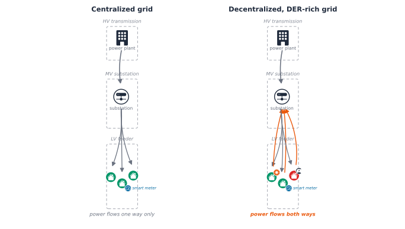

The preface opened on a feeder that tripped three times in one July, on a
street with no history of trouble. The substation reported nothing wrong.
What changed had happened behind the meters: a few new 
chargers, a dozen rooftop solar installs, a heat wave. The data that would
have shown it coming was sitting unread in fifteen-minute meter reads.

Here is the more precise version of that same problem. A smart meter reports
active and reactive power at exactly one point: the customer's connection.
It says nothing about the voltage one pole over, whether the phases feeding
three houses on the same street are balanced, or how close a transformer is
running to its thermal limit. A  cannot read any of that off
a meter, no matter how many meters it has, because none of it is what a
meter measures. This chapter builds the tool this book uses to see it
anyway: a real, small low-voltage network, modeled and solved with
open-source power-flow software, the same network every later chapter in
this part reuses.

## The low-voltage network

Every home and business gets electricity through the same three-tier chain.
A power plant generates it.  transmission lines carry it over
long distances, hundreds of kilovolts, built for distance, not for reaching
individual buildings. A substation steps that down to ,
typically single-digit to tens of kilovolts, for regional distribution.
Finally, a local distribution transformer, often the grey cylinder on a
pole or the green cabinet on a street corner, steps  down to
, the 230/400V range a house's own wiring can actually use.
The **low-voltage network** is that last tier: everything from the local
transformer to the meter on the wall.

A real feeder branches the way a tree does: one three-phase backbone leaves
the transformer, then splits into single-phase taps, called service drops,
each reaching one customer, dozens of them on a real feeder. The left side
of @fig-grid-centralized-decentralized shows this chain: power has moved
exactly one way for decades, plant to customer, no exceptions.

## Why that stopped being true

The right side of the same diagram is what changed. Clean-energy investment
reached \$1.7 trillion globally in 2023 [@iea2023investment], and a growing
share of it is landing at the low-voltage tier specifically. Rooftop
, home batteries, and  charging almost all
connect there, not at the transmission or medium-voltage tiers above it
[@bystrom2022distribution]. A household with solar panels is not a passive
consumer anymore; on a sunny afternoon it can export power back through the
exact feeder that used to only deliver it.

{#fig-grid-centralized-decentralized}

That reversal does not strain a feeder in one way. It strains it in three,
and each has a distinct signature:

- **Fluctuation.** Solar output rises and falls with the sun, not with
  demand. A feeder with heavy  penetration can see demand
  drop sharply at midday and ramp back up steeply at sunset, a shape well
  known enough to have its own name, the duck curve. A  has
  to compensate for that swing every single day, and the same variability
  that produces the swing also makes demand harder to predict, which makes
  the feeder harder to plan and manage well in advance.
- **Load growth.** Unmanaged  charging can push a feeder's
  peak demand up by as much as 64% in some reported cases
  [@ucer2020congestion; @bystrom2022distribution], and unlike a kettle or a
  washing machine, a car can draw power for hours at a stretch, stretching
  out the peak instead of just raising it. Most low-voltage feeders were
  designed decades before any of this, sized for predictable household
  demand, not a street where several homes might charge an EV or export
  rooftop solar at once.
- **Constraint violations.** Every feeder operates inside three limits:
  thermal (how much current a line or transformer can carry before it
  overheats), voltage (how far the actual voltage can drift from nominal),
  and phase balance (how evenly current is spread across the three phases).
  Fluctuation and load growth are what push a feeder toward one of these
  three limits; the limits themselves are what actually gets violated, and
  a real violation is not just a number out of range, it risks equipment
  damage, real power losses, a shortened lifespan for feeder assets, and,
  in the worst case, an outage.

## Why a meter alone can't show it

Given all that, the obvious question is why a  would not just
read the strain off its smart meters. It cannot, and the reason is exact,
not a limitation of degree: a meter and a network model answer two
different questions. A meter answers "how much power is this customer
using right now," a single Load's kW and kvar, reported once per interval.
A network model answers "what does that demand do to the rest of the
feeder," a question no single meter, or even every meter on the street
added together, can answer on its own, because it depends on where each
customer sits relative to the others and how the wire between them behaves.
Two houses on the same street can report identical, perfectly normal meter
readings while one sits at 0.95 pu and the other at 1.08 pu.

The bridge between the two is direct, and it is what the rest of this
chapter builds: a meter's own reading becomes a network model's input. One
customer's demand becomes one `Load`'s `kW`; a whole time series of meter
readings becomes what OpenDSS calls a `LoadShape`, the mechanism Chapter 2
picks up directly. Combine that meter data with the network's topology, the
impedance of every line, the phase each customer connects to, none of which
any meter reports, and solving the network answers the harder question.
That combination, real meter data plus real topology, is the mechanism
behind every thread the rest of Part 4 follows.

::: {.ark-concept}
<span class="ark-concept-title"><i class="bi bi-info-circle-fill"></i> Key Concept</span>

Every voltage number in this book's Part 4 chapters is reported in
**per-unit (pu)**: the actual voltage divided by the network's nominal
voltage at that point. A bus sitting exactly at nominal reads 1.0 pu,
regardless of whether that bus is an 11kV medium-voltage connection or a
230V single-phase house. Per-unit is what makes a voltage reading portable
across a network with several different nominal voltages, and it is the
scale every diagram in this part uses.

A typical statutory limit allows voltage to drift +10%/-6% from nominal,
1.10 pu down to 0.94 pu. Every voltage-compliance chart in this part checks
a bus against exactly that band.
:::

## Building and reading a first network

### Building it

Every simulation in this part of the book runs on
[OpenDSS](https://www.epri.com/pages/sa/opendss), EPRI's open-source
distribution power-flow solver, through
[OpenDSSDirect.py](https://github.com/dss-extensions/OpenDSSDirect.py) and
a small pythonic wrapper this project built around it, `ark.dss.Circuit`
(see the companion notebook for the full interface). It was chosen
specifically because it installs and runs identically on macOS, Linux, and
Windows: no separate application to install, no Windows-only binding.



The network this chapter builds is small on purpose: one 11kV/0.4kV
transformer, a three-phase line, and three single-phase houses, one per
phase, the same branching shape as the real feeder above, just three
customers instead of dozens. The full sequence of commands that builds it,
transformer, linecodes, lines, loads, one line at a time, is in the
companion notebook; here is the shape of it:

```python
circuit.command("New transformer.LVTR Buses=[sourcebus, A.1.2.3] ...")
circuit.command("new line.A_B bus1=A.1.2.3 bus2=B.1.2.3 ...")
circuit.command("new line.B_L1 bus1=B.1 bus2=C.1 ...")
circuit.command("new load.Load_1 bus1=C.1 phases=1 kW=7 pf=0.95 ...")
```

Once every element is defined, solving the network is one call:



A converged solve means OpenDSS found a self-consistent set of voltages and
currents across the whole network, the power-flow equivalent of balancing
a set of equations.

### Reading it back

A solved circuit holds more than bus voltages, and `Circuit` turns every
element into a plain Python iterator, no manual bookkeeping required:



Each `Line`, `Load`, and `Transformer` is a small dataclass with the fields
a chapter actually needs, `bus1`, `phases`, `kw`, `pf`, directly as
attributes:





For anything `Circuit`'s dataclasses don't model, `circuit.command` doubles
as a query, the same escape hatch OpenDSS scripting always offers, and
iteration combines naturally with it, no different from looping over any
other Python collection:





The same iterate-and-read pattern produces a power table for any element
type, one row per phase, not a flat list to index into by hand:





Not everything is wrapped yet. Per-phase current isn't, so this is a good
place to reach for `circuit.dss`, the full native OpenDSSDirect.py API,
unwrapped, one property away:



And the per-unit voltage at every bus, the number the concept box above
just defined, is a DataFrame away:



Every house here sits comfortably inside the 0.94-1.10 pu band. Reading a
table of numbers is one way to check that; seeing the network is another,
and it is usually the faster one. Everything above, in one diagram, colored
by exactly that compliance band:



Green means comfortably compliant, amber means close to a limit, red means
a real violation, the same three-way status this book's later Part 4
chapters use to talk about a feeder's health.

::: {.ark-mistake}
<span class="ark-mistake-title"><i class="bi bi-bug-fill"></i> Common Mistake</span>

Treating one solved snapshot as a verdict on a feeder's health. Every solve
above ran at one instant, one particular combination of demand across the
network. A feeder that is comfortably compliant at that instant can still
drift outside its limits at a different time of day or a different season,
exactly the fluctuation the duck curve describes above. Checking a feeder
properly means solving it across a range of realistic conditions, not once.
:::

## Checking a feeder over time

Here is what checking several conditions actually looks like, using the
same network expanded to six houses and a real annual load-duration curve:
peak demand for 1650 hours a year, 67% of peak for 4280 hours, 33% of peak
for the remaining 2830. `evaluate_loading_levels` rebuilds the circuit
fresh at each level, and `plot_voltage_compliance` shades the compliant
band directly on the chart rather than leaving the comparison to the
reader:

Building the expanded network reuses the exact same `circuit.command(...)`
calls as above, just continued further:



At peak demand, the total annual energy lost to line resistance across the
three loading levels:





And the payoff, every house's voltage at every loading level, on one chart:



Every point stays inside the compliant band here, at every loading level.
That will not stay true once solar joins the picture, which is exactly
where the companion notebook's own exercises pick up: adding PV to three of
these houses and re-running this same check. Worth working through
directly rather than reading about secondhand, and the direct subject of
Chapter 2.

Monitors, meters, and OpenDSS's own `export` command round out what the
engine can report, time-series voltage/current/power logging attached
directly to an element, without needing `Circuit` to wrap them. The
companion notebook's own Section 5 covers them in full; they're lower-value
for this chapter's purposes than the results above, but worth knowing they
exist.

## Where Part 4 goes from here

This chapter built what every later chapter in this part reuses: a real,
solvable low-voltage network, the vocabulary, per-unit voltage and the
three constraints, to judge its health, and the full `ark.dss.Circuit`
toolkit for reading a solved circuit back out. Chapter 2 picks up the very
next question this chapter's own mistake box raises: not one snapshot, but
a real year of smart-meter data driving a real time-series simulation,
plus how , storage, and inverter controls like Volt-Watt
change the answer.

From there, Part 4 follows four threads, each building on the last:

1. **Phase detection**, recovering which phase a customer is actually
   connected to from nothing but voltage patterns, a real, common gap in
   utility records.
2. **Customer and feeder clustering**, grouping customers and feeders by
   how they actually behave, not just how they are labeled.
3. **Voltage-violation and power-quality anomaly detection**, catching a
   compliance problem, or a meter reporting bad data, as it happens rather
   than after a complaint call.
4. **Grid health under forecasted  growth**, where Part 3's
   forecasts become the input to exactly the kind of power-flow check this
   chapter just ran, and mitigation strategies get evaluated against it.

Each one runs on the same tools introduced here: `ark.dss.Circuit` to
build, solve, and read a network, and the same per-unit, three-constraint
vocabulary to judge what the solve returns.

## References

::: {#refs}
:::
