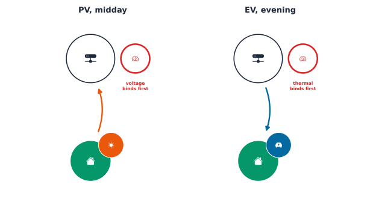

This book's whole premise is that a smart-meter reading is worth more than
its own number: aggregated, modeled, and combined with what a meter alone
can't see, network topology, everyone else's demand at the same moment, it
becomes a real business decision. Chapter 1 built the network side of that
combination, an OpenDSS model of a real  feeder, and ended on
a warning: one solved snapshot is not a verdict on a feeder's health.

This chapter is where the meter-signal side of that premise finally meets
the network. The same 31-customer AusNet feeder runs across a real week
of demand, then answers two business questions: how much rooftop solar,
and how much  charging, can this specific feeder actually
take before someone has to act on it. The two answers turn out to be very
different problems, at different times of day, binding on different
constraints, and the fix built for the first one does not generalize to
the second.

## Getting the data

This chapter needs the same AusNet  network and smart-meter
data Chapter 1 introduced, plus one more dataset: 
home-charging profiles. Neither is checked into this repository (someone
else's licensed data, vendored locally instead), so fetch both once before
running the notebook:

```bash
uv run python scripts/fetch_part4_ausnet_data.py
uv run python scripts/fetch_part4_ev_profiles.py
```

The first downloads the network model and two datasets, 342 anonymized
customers' active-power readings and their matched normalized
 generation, both at 30-minute resolution for a full year.
The second downloads  home-charging profiles derived from a
UK metering trial. That second source ships no license, so this chapter
uses it as a reference for building its own scenario, not as data reused
verbatim; every number reported below is this notebook's own.

## This chapter's feeder

Every section below runs on one network: the 31-customer AusNet feeder
Chapter 1 introduced, the same distribution transformer, the same 24 line
segments and 31 single-phase service cables. A result from the middle of
this chapter and a result from the end describe the same physical feeder,
not two unrelated ones.



## Real customers, real diversity

Before driving this feeder with real data, it is worth seeing what that
data actually looks like: not one representative household, but hundreds
of different ones.





342 households, one day, and no two profiles agree: some barely draw half
a kilowatt all day, others spike past 5kW in the evening. Averaging this
away into "the" residential load shape would erase exactly the
variability a real feeder has to survive.



 varies day to day the same way: cloudy days barely clear a
third of a clear day's peak. The hosting-capacity study later in this
chapter deliberately picks the single sunniest of these 365 days, the
worst case for that particular question.

That diversity is also why this chapter bothers deriving a `LoadShape`
from an actual reading rather than assuming one: a network fed by a
made-up "typical" profile would never show the swings the chart above
just did.

## From readings to LoadShapes

For residential customers, most utilities only bill on active energy, so
many residential smart-meter datasets only retain active power, even
though the meter hardware could measure more. This dataset reports only
active power for exactly that reason; reactive power is derived here from
an assumed power factor in the 0.95-0.99 range, the same convention the
network's original tutorial uses.



Every one of the feeder's 31 loads gets its own customer profile, sampled
from the 342 available. Attaching a `LoadShape` is one command, but
trusting it silently is a habit worth breaking: it costs little to
cross-check the underlying data array, what a live solve reports back,
and what the `LoadShape` object itself has stored, against each other.



A gap at solver-tolerance scale, well under a watt, confirms all three
views describe the same house. Catching a mismatch here is far cheaper
than noticing it three sections later in a chart that looks slightly off.

## A week of simulation

`circuit.solve_daily(steps, stepsize)` steps through a `Set Mode=daily`
solve, but a single call only ever covers one day's worth of `LoadShape`
data. A genuine time-series study covers more than one day, so every
`LoadShape` gets rebuilt at the start of each new day and the solve runs
seven times over, a full real week.





Three phases, one real week: demand rises and falls with the daily cycle,
and no two days look quite the same, exactly the kind of pattern a single
snapshot could never show.



Comfortably inside the 0.94-1.10 pu band all week, no  yet
attached. The rest of this chapter revisits this same feeder twice, once
with rooftop solar added, once with EV charging, and the envelope stops
staying so comfortable.

## Modeling PV properly

A `PVSystem` can run on a flat rating, constant output regardless of the
time of day. A more realistic model drives it from an irradiance profile
and a temperature profile instead, attached to an actual house on this
same feeder rather than a separate demonstration network.



::: {.ark-mistake}

**A 20% default nearly zeroed out the morning and evening.** OpenDSS's
`PVSystem` defaults `%cutin`/`%cutout` to 20%, the inverter output
threshold below which it will not turn on or stays off. At 10% irradiance,
a real inverter still produces something, but a 20%-cutin model reports
flat zero, and it is easy to miss unless every hour gets checked
individually: the middle of the day looks identical either way. A
realistic  system instead sets `%cutin=0.05 %cutout=0.05`.

:::



Rebuilding the same  system with the lower threshold
recovers exactly the two hours the default silently dropped.

A single house's  system modeled correctly is a technical
fix. Whether a whole feeder full of them still passes muster is a
business question, and it is the one this chapter has been building
toward since the first solved snapshot.

## The hosting-capacity crisis

This is the business question a  faces every time a new
rooftop solar application arrives: does connecting one more customer's
 system push this specific feeder past its statutory
voltage limit? Say yes too often and customers wait months for a grid
upgrade that may not have been necessary; say yes too rarely and a feeder
starts violating compliance. A hosting-capacity study is how that
question gets a feeder-specific answer instead of a guess.

A feeder can fail this test two different ways, not one. Chapter 1
introduced the three constraints an  network operates
under: thermal, voltage, and phase balance. The notebook's own
`run_penetration` function checks the first two together at every step,
as two real inequalities:
$$
\max_i V_{i,pu}(t) \le 1.10, \qquad \max_t \big|S_{transformer}(t)\big| \le S_{rated} = 500 \text{ kVA},
$$
the worst bus voltage against the statutory limit, and the transformer's
apparent power against its own 500 kVA nameplate rating.

Day 363 is the sunniest day in the dataset, the tallest curve in this
chapter's own  diversity chart, and the worst case for a
hosting-capacity study: if a penetration level is ever going to cause a
violation, a low-demand, high-sun day is where it shows up first.





The feeder-wide maximum stays inside the compliant band through 60%
penetration, then crosses the 1.10 pu statutory limit at 80%. That is a
real answer to a real question, not a theoretical ceiling: this specific
feeder, on its sunniest day, with realistically-sized rooftop systems, can
host roughly six in ten customers with solar before it needs an
intervention to host more.

Voltage is the constraint that binds first here, but it is worth checking
the other one too, since a feeder that passes the voltage test can still
fail the thermal one on a different network.



Nowhere close: even at 100% penetration, the transformer peaks under 30%
of its 500 kVA rating, an order of magnitude of headroom left. On this
feeder, voltage is the real limit, not heat. That is not true of every
 feeder; a longer or more heavily loaded one can hit its
thermal ceiling well before its voltage limit, which is exactly why a
proper hosting-capacity study checks both rather than assuming one always
dominates.

## Fixing the crisis

80% penetration is the violation found above. The same scenario, the same
25  systems on the same feeder, gets Volt-Watt and Volt-VAr
control applied directly rather than a fresh demonstration network. Both
are smart-inverter functions standardized by  1547-2018
[@ieee1547-2018], modeled in OpenDSS as an `InvControl` element driven by
an `XYCurve` of four voltage/output setpoints. A single `InvControl` with
no explicit `PVSystemList` applies to every `PVSystem` in the circuit at
once, all 25 of them here, no per-house wiring required.

**Volt-Watt** curtails real-power export once voltage crosses a
threshold, a piecewise-linear function of the local bus voltage $V$:
$$
P(V) = P_{rated} \times
\begin{cases}
1 & V \le 1.05 \\[4pt]
\dfrac{1.10 - V}{1.10 - 1.05} & 1.05 < V < 1.10 \\[4pt]
0 & V \ge 1.10
\end{cases}
$$
full output stays available up to 1.05 pu, then ramps linearly
down to zero at 1.10 pu. It works, but it reduces the total generation
exported. **Volt-VAr** takes a different lever: instead of cutting real
power, it asks the inverter to absorb or supply reactive power, the same
principle behind Conservative Voltage Reduction, flattening a feeder's
voltage profile without reducing real generation.





Both bring the feeder back under the 1.10 pu line, and Volt-VAr does it
without curtailing a single kilowatt of generation. Volt-Watt curtails
real power directly; Volt-VAr does not, which makes it the better first
option to try before accepting reduced generation.

That single point, 80% penetration, is where the violation happens to
show up first, but the question worth asking is bigger than one point:
does either control raise the feeder's hosting capacity across the board,
not just patch this one level?



Neither control ever crosses the 1.10 pu line across the entire sweep,
all the way to 100% penetration. The 80%-penetration ceiling this section
opened with was not a hard limit on the feeder; it was a limit on running
 without mitigation. With either control active, this same
feeder can host every customer on it.

## Storage: a third lever

Volt-Watt and Volt-VAr both react to a violation the instant it happens.
A battery can act ahead of it instead: charge on a sunny midday when
 export is pushing voltage up, discharge into the evening
peak when demand is pulling it down. A `Storage` element is a
dispatchable battery, bounded by its own rated power and energy capacity,
its output sign set by its commanded state rather than by the weather or
the time of day.



The comment in that cell is worth reading as carefully as the code:
OpenDSSDirect.py is a singleton engine, one compiled circuit per process,
so two `Circuit` objects can exist in Python at once, but only one of them
is ever telling the truth about what is currently solved. Reading each
result immediately after its own solve avoided a real version of this
bug, caught while drafting this notebook, not just a hypothetical one.

## EV demand: the opposite failure mode

Every section so far has been about  pushing power out onto
the feeder at midday. Electric vehicles push demand the other way: an EV
charger is a load, not a generator, and it draws power precisely when a
feeder is already under the most strain, the evening, after commuters get
home and plug in, right on top of ordinary dinner-time demand. This
chapter's own transformer-loading chart already showed the week's
sharpest peaks land in the evening, before a single EV was in the
picture. The question this section asks: does the same feeder that
nearly failed a  test at midday also fail an 
test in the evening, and if Volt-Watt and Volt-VAr fixed the first
problem, do they do anything for the second?

{#fig-pv-vs-ev-failure-mode}

This chapter also draws on  home-charging profiles derived
from a UK metering trial: metered charging behavior, not a synthetic
assumption, for Level 1 (3.68kW) and Level 2 (7.36kW) chargers,
diversified across a group of vehicles to account for the fact that not
everyone charges at the same time. The source repository for this data
ships no license, unlike the network and smart-meter data behind the rest
of this chapter, so it is used here as a reference for building this
chapter's own scenario, not reused verbatim.





A late-afternoon-into-evening peak, exactly the window this chapter's own
transformer chart already flagged as the feeder's busiest. Diversifying
$N$ real vehicles' own charging profiles is a plain average across the
group at each real time step $t$,
$$
\bar{P}(t) = \frac{1}{N}\sum_{n=1}^{N} P_n(t), \qquad \text{CF}(t) = \frac{\bar{P}(t)}{P_{rated}},
$$
where $P_n(t)$ is vehicle $n$'s own real charging power, 0 or the
charger's rated power depending on whether it happens to be plugged in
and drawing at that instant, and $\text{CF}(t)$, the coincidence factor,
is that average expressed as a fraction of one charger's own full rating.
The diversified curve peaks around 1.5kW per , not the
charger's full 7.36kW rating, a peak coincidence factor of roughly 0.2:
most vehicles in the group are not charging at any given
moment, so the average demand per  stays well under the
rated maximum. That diversity is a genuine, physical mitigating effect,
worth testing directly rather than assuming.

Every -owning house on this feeder gets its own copy of the
diversified shape, an additional `Load` that adds demand on top of a
house's existing consumption rather than offsetting it. This time the
worst-case day is not the sunniest, it is the day with the highest
evening demand across the whole customer population, found the same way
this chapter's  study found day 363: by checking, not
assuming.







Even at 100% adoption, every house on the feeder charging an ,
neither constraint moves far from baseline: worst-case voltage stays
above 1.06 pu and transformer utilization tops out around 20%. Diversity
is doing real work here: the UK-trial data says not enough
s charge at the same instant for this feeder to notice,
even at full adoption.

That is the realistic case. It is worth asking what breaks the
mitigating effect diversity provides, since a feeder should not be sized
assuming every driver charges considerately. An uncoordinated scenario,
common in hosting-capacity studies precisely because it is the assumption
a  cannot rule out, has every  owner plug in
at the same evening peak and charge at the charger's full rated power, no
diversity at all.





Worse than the realistic case, as expected, but still not a violation:
even every one of the 31 houses charging simultaneously at full rated
power tops out around 61% transformer utilization and 1.02 pu,
comfortably inside both limits. This feeder's 500 kVA transformer, sized
for 31 customers, has more headroom than either  scenario
tested so far actually needs.

A finding of "no violation" is only useful if it comes with a sense of
margin, so the same uncoordinated scenario scales to multiple
s per house, a real possibility for any household with more
than one car.



::: {.ark-mistake}

**Thermal breaks first here, not voltage, the opposite order from the
 story.** At two s per house, transformer
utilization crosses 100% while voltage is still compliant; it takes
three s per house, well past realistic, before voltage
also fails.  pushed this feeder into a *voltage* violation
first; heavy  charging would push it into a *thermal*
violation first. Checking only one constraint because it was the one
that mattered for the last  studied would have missed
this.

:::

Volt-Watt and Volt-VAr both work by controlling `PVSystem` elements: an
`InvControl` with no `PVSystemList` reaches every  inverter
on the feeder. An  charger modeled as a `Load` is a
different kind of element entirely, so the mitigation that solved the
midday violation has nothing to act on in an evening 
scenario. Of the levers this chapter has built, only `Storage` can help
both peaks: charge from midday 
surplus, discharge into the evening -and-dinner peak, the
two problems this feeder's own daily cycle actually produces. That is
precisely the kind of -aware mitigation strategy Part
4's fourth thread evaluates in full.

## Do it yourself

The  story just closed on a question about how a mitigation
strategy is chosen; this chapter's own  hosting-capacity
study is worth revisiting with a question about how its answer was
chosen in the first place. The hosting-capacity crisis earlier in this
chapter answered one version of "how much  is too much,"
on this feeder's single sunniest day of the year. A related but
different version of that same question is worth working through before
reading the solution below.

### Exercise: does the answer depend on which "worst case" you pick?

Day 363 is the single most extreme day in an entire year of data, the
tallest curve in this chapter's own  diversity chart. A
 planning for the future might instead ask a seasonal
version of the same question: for a typical summer day, a typical winter
day, and so on, each with its own representative worst-case solar
profile, does this feeder still hit a violation?

The vendored data includes four seasonal  files, each
holding three candidate daily profiles for that season, drawn from the
same AusNet dataset, paired with a specific demand day per season.

**E1:** For each season, find the candidate  profile with
the highest peak, then run the same penetration sweep from earlier in
this chapter using that season's demand day and worst 
profile. Does every season cross 1.10 pu the way day 363 did? While you
are at it, check the transformer's thermal utilization for each season
too.

#### Solution

`run_penetration`'s `pv_profile_override` parameter exists for exactly
this, passing in a specific  array instead of indexing into
the full year of data by day.





::: {.ark-mistake}

**No season crosses 1.10 pu, even at 100% penetration, and the thermal
check agrees: every season's peak transformer utilization stays under
30%, the same order of magnitude as the earlier result.** That does not
contradict the earlier finding, it sharpens it. Day 363's 
profile peaks at the single highest reading in the entire 365-day year;
the seasonal files' own worst case tops out lower, around 0.92 even for
spring, the strongest season here. "Worst case" is a modeling choice, not
a fact about the world, and this feeder's answer to "how much
 can it host" depends on which worst case gets asked for:
the single most extreme real day on record, or the worst of three
representative candidates per season. A properly documented
hosting-capacity study states which one it used, the same way this
chapter just did twice, with two different, both defensible, answers.

:::

## Where this leaves Part 4

Every section in this chapter ran on one real feeder: honest customer
diversity, a full week of demand, a real violation at 80%
 penetration, and two working fixes for it, then a second,
genuinely different violation from  charging that neither
fix could touch. Part 4 now follows four threads, each building on the
same `ark.dss.Circuit` this chapter just extended:

1. **Phase detection**, recovering which phase a customer is actually
   connected to from nothing but voltage patterns, a real, common gap in
   utility records.
2. **Customer and feeder clustering**, grouping customers and feeders by
   how they actually behave, not just how they are labeled.
3. **Voltage-violation and power-quality anomaly detection**, catching a
   compliance problem, or a meter reporting bad data, as it happens rather
   than after a complaint call.
4. **Grid health under forecasted  growth**, where Part 3's
   forecasts become the scenario driver for exactly the kind of
   hosting-capacity study this chapter just ran, and mitigation strategies
   like Volt-Watt, Volt-VAr, and storage get evaluated against it
   directly.

## References

::: {#refs}
:::
