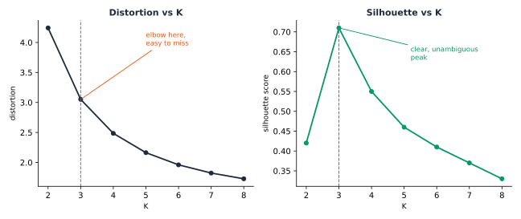

The primary bottleneck in the energy transition is not generation capacity, but rather the low-voltage network, which was constructed decades before bidirectional power flows were anticipated. Technologies such as rooftop solar, home batteries, and  chargers are integrated incrementally at the property level, often remaining undetected by a  until operational failures, such as feeder trips or transformer overheating, occur. This scenario mirrors the failure experienced by the opening feeder in Part 4 Chapter 1. While a  serving a few hundred customers can feasibly monitor each individually, this approach becomes unfeasible at the scale required for a comprehensive energy transition. According to Wang, Chen, Hong, and Kang, clustering is identified as one of the three core pillars of smart meter analytics, alongside forecasting and load management [@wang2019smartmeterreview]. Transforming a vast number of individual customers into a manageable set of recurring patterns is necessary for maintaining the tractability of -driven complexity.

A year-long analysis of demand across AusNet's 342 households found 342 unique consumption patterns. Each customer has distinct power usage in timing, magnitude, and motivation. Averaging these patterns produces a result that does not reflect any individual customer. Likewise, a  cannot plan feeders, set tariffs, or manage demand-response programmes using 342 separate profiles. The practical approach is to identify a small set of recurring patterns that capture the diversity in these load curves. However, grouping similar patterns remains a complex challenge.

"Clustering" has no universal definition, and no single correct answer for how many groups a population like this one actually contains. Jain's own retrospective on fifty years of work past k-means is explicit about this: the choice of objective function is itself a modelling decision, not a fact waiting to be discovered [@jain2010clustering50years]. Four real questions this chapter answers, in order, before any chapter in this part clusters a single real customer:

- What formal criterion determines whether two customers or two feeders belong to the same category?
- Does a load curve require a specialised notion of distance and representation, or is a standard approach sufficient?
- In the absence of ground-truth labels, how can the validity of a discovered grouping be assessed to ensure it is not merely an artefact of the algorithm?
- How should background knowledge, such as information about customers sharing a physical feeder, directly constrain the clustering procedure instead of being used only to describe results after the fact?

{#fig-clustering-paradigm-landscape}

## Four ways to define a cluster

There are four main objective families that address the initial question. These families cover most relevant aspects discussed here. Each family optimises a specific criterion and identifies different structural patterns within the same population.

::: {.ark-concept}
<i class="bi bi-info-circle-fill"></i> Key Concept

**Partition-based** objectives aim to identify $K$ centroids that minimise within-cluster distances. This approach is based on MacQueen's k-means formulation, later refined by the Lloyd algorithm and by Arthur and Vassilvitskii's careful seeding, which addresses sensitivity to poor random initialisation [@macqueen1967kmeans; @arthur2007kmeanspp].

**Hierarchical objectives** build a tree by merging the two closest groups at each step, using one of three linkage rules. The single linkage rule considers the closest pair between groups, $d_{SL}(G,H) = \min_{i\in G, i'\in H} d_{i,i'}$. The complete linkage rule considers the farthest pair, $d_{CL}(G,H) = \max_{i\in G,i'\in H} d_{i,i'}$, while the average linkage rule takes the mean over every cross-group pair, $d_{avg}(G,H) = \frac{1}{n_G n_H}\sum_{i\in G}\sum_{i'\in H} d_{i,i'}$, the family Ward's own minimum-variance criterion belongs to [@ward1963hierarchical].

**Density-connectivity objectives** group points into chains of nearby neighbours, avoiding the use of a fixed number of centroids. In the DBSCAN algorithm by Ester, Kriegel, Sander, and Xu, a point is classified as a core point if it has a sufficient number of neighbours within a specified radius, as a border point if it neighbours a core point but does not meet the core criteria itself, and as noise otherwise [@ester1996dbscan].

**Graph-based and spectral objectives** define clustering as partitioning a similarity graph. For example, Ng, Jordan, and Weiss propose the normalised cut criterion:
$$\text{Ncut}(S_1,\dots,S_K) = \frac{1}{2}\sum_{k=1}^{K}\frac{\text{cut}(S_k,\bar{S}_k)}{\text{vol}(S_k)}$$
where $\text{cut}(S_k,\bar S_k) = \sum_{i\in S_k, j\notin S_k} w_{ij}$ represents the total similarity weight crossing the cut, and $\text{vol}(S_k) = \sum_{i \in S_k} d_i$ is the total degree within $S_k$. The problem is solved using the eigenvectors of the graph Laplacian $L = D - W$ [@ngjordanweiss2002spectral].
:::

![Each clustering objective family optimises a distinct criterion. Partition-based methods generate Voronoi-like regions centred around a centroid. Hierarchical approaches construct a tree and select a cut that yields the desired number of groups. Density-connectivity methods identify clusters of arbitrary shape and classify genuine outliers as noise rather than assigning them to clusters. Graph or spectral methods partition a similarity graph into the smallest number of components with minimal total edge weight.](../../assets/clustering-objective-families.svg){#fig-clustering-objective-families}

**Hierarchical clustering** is especially relevant here, as it is among the most widely used methods in the energy literature. Michalakopoulos et al. conducted a comparative analysis of k-means, k-medoids, hierarchical clustering, and DBSCAN using empirical data from a London population, the same population Chapter 2 settles a methodology on [@michalakopoulos2024clustering]. Murphy's textbook provides a comprehensive treatment of all four families, including worked numeric examples, which serves as a common reference point for this chapter and Part 2's unsupervised-learning chapter, not a citation to re-derive from scratch.

Computational cost varies sharply across these four families, and that cost is itself a real selection criterion, not merely an implementation detail. Partition-based methods scale the most gently, $O(nKdI)$ for $n$ points, $K$ centroids, $d$ dimensions, and $I$ iterations, making them the practical default at real utility scale. Hierarchical methods are markedly more expensive: $O(n^2)$ space and $O(n^3)$ time in the naive implementation, reducible to $O(n^2 \log n)$ with a priority queue, a cost Murphy's own textbook quantifies directly. Density-connectivity methods such as DBSCAN cost $O(n \log n)$ once a spatial index is available, but degrade to $O(n^2)$ without one. Graph and spectral methods carry the heaviest cost of the four, typically $O(n^3)$ for the eigendecomposition of the similarity graph's Laplacian, a real practical limit on how many customers or feeders a single spectral run can handle before an approximate or sparse solver becomes necessary.

These costs translate directly into a real selection criterion. A roughly known number of compact, well-separated groups favours a partition method, the cheapest of the four. A need to explore several candidate values of $K$ from one run, rather than commit to one in advance, favours a hierarchical method's dendrogram, at real extra cost. An expectation of genuine noise or non-convex shapes within the population, rooftop-solar adopters following an irregular seasonal curve rather than a tidy blob, say, favours density-connectivity. A similarity structure that a raw distance does not capture well, but a graph of pairwise relationships does, favours graph or spectral methods, provided the population is small enough, or the graph sparse enough, for that heavier cost to be worth paying.

## Distance and representation

A load curve presents a more challenging target for any of these four families than generic tabular data, the second question above. Two households can share the same real evening routine and still be a few minutes out of phase, a genuine behavioural match that raw Euclidean distance reads as a mismatch.

::: {.ark-concept}
<i class="bi bi-info-circle-fill"></i> Key Concept

Sakoe and Chiba's  algorithm addresses a more general form of this problem. The alignment cost is determined using dynamic programming instead of a fixed point-by-point comparison, a method originally developed for spoken word recognition rather than for analysing power curves [@sakoechiba1978dtw]. For two time series $x = (x_1,\dots,x_n)$ and $y = (y_1,\dots,y_m)$, the cumulative alignment cost is computed recursively as follows:
$$D(i,j) = d(x_i, y_j) + \min\{D(i-1,j),\ D(i,j-1),\ D(i-1,j-1)\}$$
where $D(0,0) = 0$ and all other boundary cells are set to $\infty$. The  distance between the two series is defined as $D(n,m)$, the cost of the least expensive monotonic path through the pairwise distance matrix, in contrast with the fixed diagonal path plain Euclidean distance is forced to take. Aghabozorgi, Shirkhorshidi, and Wah's review of time-series clustering identifies this type of representation and distance choice as an open research question, rather than one already resolved by generic clustering theory [@aghabozorgi2015timeseries].
:::

{#fig-dtw-vs-euclidean}

The convention the rest of this part follows, comparing peak-normalised shapes using plain Euclidean distance, is a defensible simplification for regularly sampled, already time-aligned  data. Aghabozorgi's review indicates that Euclidean distance performs comparably to warped alignment for such regular time series, although this is not a universal solution for every kind of time series.

Later chapters introduce two additional representations that extend this concept beyond a single flat feature vector. A single customer's demand is better represented as an entire season of daily curves stacked together, organised by customer, day, and time-of-day, forming a genuine three-way array rather than a simple table. Tucker's multi-way factorisation, originally developed for psychometric factor analysis, is designed to factorise exactly this type of tensor $\mathcal{X} \in \mathbb{R}^{I\times J \times K}$ into a smaller core tensor and one factor matrix per mode, $\mathcal{X} \approx \mathcal{G} \times_1 A \times_2 B \times_3 C$, the direct three-way generalisation of the standard matrix factorisation underlying principal component analysis [@tucker1966threemode]. In contrast, Coifman and Lafon's diffusion maps employ a nonlinear approach to achieve a similar objective. They construct a Markov transition matrix $P = D^{-1}W$ from a kernel similarity, followed by an embedding derived from the top eigenvectors, each scaled by its corresponding eigenvalue raised to a diffusion time $t$, $\Psi_t(i) = (\lambda_1^t \psi_1(i), \lambda_2^t \psi_2(i), \dots)$. This method captures manifold structure that a single graph cut may overlook, by watching where a random walk actually spends its time, not just which edges it crosses once [@coifmanlafon2006diffusionmaps].

::: {.ark-concept}
<i class="bi bi-info-circle-fill"></i> Key Concept

Real  data rarely arrives ready to cluster. Aghabozorgi, Shirkhorshidi, and Wah's own review treats this as a distinct stage in its own right, prior to and separate from the choice of distance measure [@aghabozorgi2015timeseries]. A gap from a missed meter read needs to be imputed or the affected day excluded outright, not silently filled with zero, which would fabricate a false trough rather than an honest absence of data. Every customer's readings need a common, regular sampling interval before any distance calculation is meaningful, since comparing a fifteen-minute series against a thirty-minute one is not comparing shape at all. And the aggregation window itself, a single day, a full week, or a season, is a real modelling choice, not an afterthought: too short a window mistakes one unusual day for a customer's whole pattern, while too long a window can average away exactly the behavioural shift a later chapter's own stability check is built to detect.
:::

::: {.ark-mistake}
<i class="bi bi-bug-fill"></i> Common Mistake

Adding more features may appear to enhance safety by providing additional information. This becomes problematic, however, once the number of features approaches the size of the population being clustered: as dimensionality increases, pairwise distances tend to concentrate, genuine and spurious structure become harder to tell apart, and a clustering algorithm may begin to report splits that are merely artefacts of noise, rather than meaningful groupings. Ezugwu et al. and Ren et al. both identify the curse of dimensionality as an ongoing, unresolved challenge in their own recent surveys, rather than a problem that clustering theory has already retired [@ezugwu2022clustering; @ren2024deepclustering]. A subsequent chapter in this part runs directly into a concrete example of this specific failure mode, not just the general warning.
:::

Reducing dimensions is the standard answer to that warning, and it raises its own real question: once a technique like  or a nonlinear embedding is in play, how many of its components are actually worth keeping. A fixed rule, keep enough to reach 90% of cumulative explained variance, is common but arbitrary, chosen for convenience rather than derived from the data's own structure.

::: {.ark-concept}
<i class="bi bi-info-circle-fill"></i> Key Concept

Zhu and Ghodsi's profile-likelihood method offers a principled alternative, an automatic change point in the eigenvalue spectrum itself, with no threshold to tune [@zhu2006profilelikelihood]. Model the top $q$ eigenvalues and the remaining $p - q$ as two Gaussian groups sharing one pooled variance, and choose the $q$ that maximises the resulting profile log-likelihood:
$$\ell(q) = \sum_{i=1}^{q} \log \mathcal{N}(\lambda_i \mid \mu_1, \sigma^2) + \sum_{i=q+1}^{p} \log \mathcal{N}(\lambda_i \mid \mu_2, \sigma^2)$$
where $\lambda_1 \geq \dots \geq \lambda_p$ are the ordered eigenvalues, $\mu_1, \mu_2$ are each group's own mean, and $\sigma^2$ is pooled across both so the profile likelihood cannot diverge by shrinking one group's variance to zero. A later chapter checks this method directly against the fixed 90%-variance rule on this book's own real data, and reports where the two agree and where they genuinely diverge.
:::

::: {.ark-mistake}
<i class="bi bi-bug-fill"></i> Common Mistake

Assuming every real population handed to a clustering algorithm is already one population. A vacant property still reports a smart-meter reading, near-zero and flat, that can look like a real, distinct behavioural archetype rather than the simple absence of a household behind it, and a faulty meter can report a stuck or clipped value that reads as an extreme outlier rather than a data-quality problem, neither is a new kind of behaviour worth clustering. A subtler version of the same mistake is mixing customer types that only look uniform on paper: residential and commercial customers, or genuinely different climates, are not one population for shape-based clustering's own purposes, however uniform the billing category looks. A later chapter's own check against a real, independently labelled population that mixes residential and commercial buildings runs into exactly this problem, and reports the real, honest limit it finds there rather than smoothing it over.
:::

## Clustering under constraints

The fourth question, real background knowledge constraining a clustering directly, has generated its own distinct body of literature, commonly referred to as constrained clustering.

::: {.ark-concept}
<i class="bi bi-info-circle-fill"></i> Key Concept

Wagstaff, Cardie, Rogers, and Schrödl's COP-KMeans algorithm modifies the standard k-means assignment step by incorporating two types of side information: a **must-link** constraint, which requires two points to be assigned to the same cluster, and a **cannot-link** constraint, which prohibits such an assignment. The algorithm simply rejects any assignment that would violate either, rather than optimising a soft penalty for breaking one [@wagstaff2001constrainedkmeans].
:::

{#fig-must-link-cannot-link}

This is the exact vocabulary a later chapter in this part needs once it starts clustering customers under the constraint that some of them share a single real physical feeder, a fact that a distance function alone cannot capture and should not be left to discover by accident.

## The state of the art

The energy-domain literature has evolved from initial systematic comparisons to an increasing focus on representation learning. Chicco's 2012 overview was the first to compare clustering methods for load-pattern grouping side by side, rather than introducing yet another method in isolation [@chicco2012overview]. McLoughlin, Kwac, and Haben demonstrated that shape-based clusters reflect actual behaviour, not merely statistical artefacts [@mcloughlin2015clustering; @kwac2014segmentation; @haben2016clustering]. Wang, Chen, Hong, and Kang's 2019 review positions clustering as one of three main pillars of smart-meter analytics, alongside forecasting and load management, rather than as a niche technique [@wang2019smartmeterreview]. Rajabi et al. (2020) pushed toward rigorous comparative benchmarking of clustering techniques specifically for load patterns [@rajabi2020comparative].

In parallel, another line of research replaces hand-engineered shape features with learned ones entirely. Xie, Girshick, and Farhadi's Deep Embedded Clustering [@xie2016dec] and Guo et al.'s improved version [@guo2017idec] have been broadly surveyed by Ezugwu et al. (2022, 847 citations) [@ezugwu2022clustering], Ren et al. (2024) [@ren2024deepclustering], and Alqahtani et al.'s time-series-specific deep-clustering review [@alqahtani2021deeptimeseries]. Two recent and quite distinct real-world applications demonstrate the field's current range: Satre-Meloy, Diakonova, and Grünewald link clustered peak-demand profiles to real occupant-activity data [@satremeloy2020peakdemand], and Eskandarnia, Al-Ammal, and Ksantini built an autoencoder-based load-profiling framework end to end [@eskandarnia2022deepclustering]. Yerbury et al.'s CROCS is the most current and most directly relevant precedent, a two-stage framework that first summarises each consumer's own representative daily behaviours, then clusters consumers by how similar those summaries are [@yerbury2026crocs]. Not one of these, across a full decade of work, tests whether its own findings survive contact with a second, independently collected population, with more than a handful of clustering paradigms compared side by side. A later chapter in this part addresses this gap directly.

## Evaluating a clustering

Every clustering method the rest of this part builds answers to the same set of real, literature-grounded decisions, in the order a practitioner actually faces them, starting with shape, not magnitude: two households can draw very different absolute power and still share the same underlying rhythm, and clustering on raw magnitude separates them by household size instead of behaviour. Every clustering method later in this part clusters on shape, established here first, applied concretely starting in the next chapter.

{#fig-shape-vs-magnitude}

Distance and representation matter too: Euclidean-on-shape, elastic alignment (), a multi-way tensor factorisation, a nonlinear manifold embedding, and a learned representation (DEC, IDEC, Chronos-2) trade off real compute cost against what kind of similarity actually gets captured, the tradeoff Aghabozorgi, Ren, and Alqahtani's reviews all name directly. None is a free upgrade over the others.

::: {.ark-concept}
<i class="bi bi-info-circle-fill"></i> Key Concept

Relying on a single validity index is never sufficient. Three separation-based indices recur throughout this part, each built from a different ratio of the same two ingredients, within-cluster compactness and between-cluster separation. The silhouette coefficient, introduced by Rousseeuw, measures how well each point fits within its assigned cluster compared to the closest alternative cluster [@rousseeuw1987silhouette].
$$s(i) = \frac{b(i) - a(i)}{\max\{a(i), b(i)\}}$$
Here $a(i)$ is the mean distance from point $i$ to the other members of its own cluster, and $b(i)$ is the mean distance to the members of the nearest other cluster. Davies and Bouldin instead compare each cluster to its own worst-case neighbour [@daviesbouldin1979clusterseparation]:
$$DB = \frac{1}{K}\sum_{i=1}^{K}\max_{j \neq i}\left(\frac{\sigma_i + \sigma_j}{d(c_i, c_j)}\right)$$
where $\sigma_i$ is the mean distance of cluster $i$'s own members to their centroid $c_i$, and $d(c_i, c_j)$ is the distance between two centroids; lower values mean better-separated clusters. Caliński and Harabasz take a variance-ratio view instead [@calinskiharabasz1974dendrite]:
$$CH = \frac{SS_B / (K - 1)}{SS_W / (n - K)}$$
where $SS_B$ is the between-cluster sum of squares (each centroid's own squared distance to the overall mean, weighted by cluster size) and $SS_W$ is the within-cluster sum of squares (every point's own squared distance to its cluster's centroid); higher values mean better-separated clusters. Jain's own retrospective is explicit that no single index is universally correct, and the rest of this part checks more than one every time a real number of clusters has to be chosen.
:::

::: {.ark-mistake}
<i class="bi bi-bug-fill"></i> Common Mistake

Checking multiple separation-based indices and treating their agreement as confirmation. Silhouette, Davies-Bouldin, and Calinski-Harabasz are three different formulas built from the same two ingredients, compactness and separation. They agree precisely where all three are equally blind: an isolated outlier, a single point far from everything else, satisfies every separation-based definition of a good cluster at once, however small that cluster is. None of the three has a term that penalises one group holding almost none of the population. A balance measure closes that specific gap, entropy over the cluster-size distribution [@shannon1948mathematicaltheory]:
$$H(\mathbf{p}) = -\sum_{k=1}^{K} p_k \log p_k, \qquad p_k = n_k / n$$
normalised to $[0, 1]$ by dividing by $\log K$, its own maximum when every cluster is exactly the same size. Balance is cheap to compute and needs no resampling, but it is a symptom check, not proof that a cluster is real: a genuine rare archetype and a fabricated one can both score low. A later chapter finds a concrete, real example of separation-index agreement hiding exactly this failure, and builds a decision rule around balance and resampling evidence together rather than separation alone.
:::

## Choosing K

The silhouette coefficient serves a dual purpose. When averaged across all points, it helps determine the actual number of clusters in a population, eliminating the need for a distortion curve's elbow.

{#fig-choosing-k}

::: {.ark-mistake}
<i class="bi bi-bug-fill"></i> Common Mistake

Determining the optimal value of $K$ using the elbow of a distortion or inertia curve presents significant challenges. Distortion, by definition, decreases monotonically as $K$ increases because the addition of clusters reduces within-cluster distances. As demonstrated in Murphy's textbook, the elbow in the distortion curve is often difficult to identify, particularly at values of $K$ where the silhouette curve exhibits a distinct peak. Consequently, subsequent chapters assess multiple validity indices rather than relying solely on a single curve.
:::

## Checking stability

When no ground truth exists, several complementary methods ask whether a clustering is trustworthy, not just well-scored. Each answers a genuinely different version of "checking stability."

Strehl and Ghosh's Cluster-based Similarity Partitioning Algorithm asks whether an algorithm keeps finding the same structure across several independent runs on the same objects [@strehl2002clusterensembles]. It builds a consensus similarity matrix.
$$S = \frac{1}{r}HH^\top,\qquad S_{ij} = \frac{1}{r}\sum_{m=1}^{r}\mathbb{1}\!\left[\lambda_m(i) = \lambda_m(j)\right]$$
This value shows how often, across $r$ independent clusterings, objects $i$ and $j$ appear together in the same cluster. Part 4 Chapter 3 used this co-association idea for phase identification, building on the work of Blakely and Reno [@blakely2020coassociation].

That is a real question, and a different one from whether a clustering's own structure survives the data itself coming out slightly differently, not just the algorithm's own randomness on one fixed sample. Two resampling-based methods, neither invented for smart-meter data specifically, answer that second question directly.

::: {.ark-concept}
<i class="bi bi-info-circle-fill"></i> Key Concept

Tibshirani and Walther's prediction strength treats clustering as an implicit classification problem [@tibshiranwalther2005predictionstrength]. Split the data into two random halves $A$ and $B$. Cluster each independently into $K$ groups. Fit centroids on $A$'s own clustering, and predict $B$'s cluster membership from those centroids by nearest distance. For each of $B$'s own clusters $C$, the co-membership agreement is
$$\text{ps}(C) = \frac{1}{n_C(n_C - 1)} \sum_{\substack{i, i' \in C \\ i \neq i'}} \mathbb{1}\!\left[\text{pred}(i) = \text{pred}(i')\right]$$
the fraction of same-cluster pairs in $B$ that the $A$-trained centroids also predict together. Prediction strength for $K$ is the minimum of $\text{ps}(C)$ over $B$'s own clusters. Tibshirani and Walther's own recommendation is to pick the largest $K$ with prediction strength above 0.8 to 0.9.
:::

::: {.ark-concept}
<i class="bi bi-info-circle-fill"></i> Key Concept

Hennig's cluster-wise stability asks a narrower question than prediction strength: not whether $K$ as a whole is safe to trust, but whether one specific cluster survives being found again [@hennig2007clusterwise]. Bootstrap-resample the data with replacement. Fit centroids on the resample. Predict cluster membership for the entire original dataset from those centroids. Compute the Jaccard overlap between each original cluster $C$ and its best match among the predicted clusters.
$$J(C, C') = \frac{|C \cap C'|}{|C \cup C'|}, \qquad \text{stability}(C) = \frac{1}{B}\sum_{b=1}^{B} \max_{C'_b} J(C, C'_b)$$
averaged over $B$ bootstrap resamples. Hennig's own interpretation bands read stability below 0.5 as dissolved, 0.6 to 0.75 as patterned but not stable, and above 0.75 as stable.
:::

Every method above, the ensemble check and both resampling checks, ultimately compares two partitions of the same objects and needs a way to score how much they agree. Two indices do that job, each correcting for the agreement chance alone would produce.

::: {.ark-concept}
<i class="bi bi-info-circle-fill"></i> Key Concept

Hubert and Arabie's Adjusted Rand Index () counts every pair of objects and asks whether two partitions agree on whether that pair belongs together [@hubert1985comparing]. It then subtracts the agreement expected from random chance, and rescales so a perfect match scores 1 and a chance-level match scores 0.
$$\text{ARI} = \frac{\sum_{ij}\binom{n_{ij}}{2} - \left[\sum_i \binom{a_i}{2}\sum_j \binom{b_j}{2}\right]\big/\binom{n}{2}}{\frac{1}{2}\left[\sum_i \binom{a_i}{2} + \sum_j \binom{b_j}{2}\right] - \left[\sum_i \binom{a_i}{2}\sum_j \binom{b_j}{2}\right]\big/\binom{n}{2}}$$
Here $n_{ij}$ is the number of objects placed in group $i$ by one partition and group $j$ by the other at once, and $a_i$, $b_j$ are each partition's own group sizes. Strehl and Ghosh's Normalised Mutual Information () asks a related but different question, how much does knowing one partition reduce real uncertainty about the other [@strehl2002clusterensembles]:
$$\text{NMI}(U, V) = \frac{I(U, V)}{\tfrac{1}{2}\left[H(U) + H(V)\right]}$$
where $I(U, V)$ is the mutual information between the two partitions and $H(\cdot)$ is Shannon entropy. Neither index rewards a partition just for having a similar number of groups to the one it is compared against; both only reward it for actually grouping the same real objects together.
:::

A later chapter puts all four of these methods to work on this book's own real data, and reports at least one case where a clustering that reads well on separation alone does not survive contact with a resample.

## Validating against reality

Every method above, separation indices, balance, ensemble agreement, and resampling stability, measures how well a clustering is structured. None of them, alone or together, can confirm a clustering is correct. None can even confirm the structure it measures is real rather than an artefact of one extreme point. The next chapter turns that gap into its own central question, applying this chapter's own tools together for the first time rather than inventing new ones, before any later chapter trusts a clustering result at all. Once a settled methodology has survived that check, a further chapter addresses a second, complementary gap by introducing a controlled behavioural change: a deliberate intervention with a known outcome, allowing direct comparison between clustering results and ground truth in a way no internal index or resampling check can offer by itself.

## Where this leads

None of this is only theoretical. A validated cluster becomes a real lever a  can pull: a tariff designed around a real archetype's own rhythm rather than a population average, a targeted upgrade programme aimed at the customers actually likely to strain a feeder first, or a demand-response cohort chosen because its members' own behaviour predicts they will respond, not because they happen to share a billing category.

The four central questions introduced in this chapter shape the structure of the chapters that follow. The next chapter does not yet cluster a single real customer; it settles the methodology first, which of this chapter's own open questions, feature representation, dimensionality, and above all validity, actually matter in practice, checked against three independent real utilities before any of them is trusted as a settled choice. Only once that recipe is settled does the chapter after it apply it, for the first time, to AusNet's real customers and feeders. Later chapters test whether that same settled approach, together with four different data representations, a two-stage summary focused on behaviour, tensor decomposition, a learned foundation-model embedding, and a diffusion-map perspective, produces consistent definitions of real structure across various populations, including households in London and Spain. The analysis then expands to higher levels of aggregation, such as entire substations, and explores new contexts, comparing real charging sessions with daily routines. The final chapter in this sequence examines clustering directly constrained by the physical feeder graph, bringing the methodological journey to a conclusion.

## References

::: {#refs}
:::
