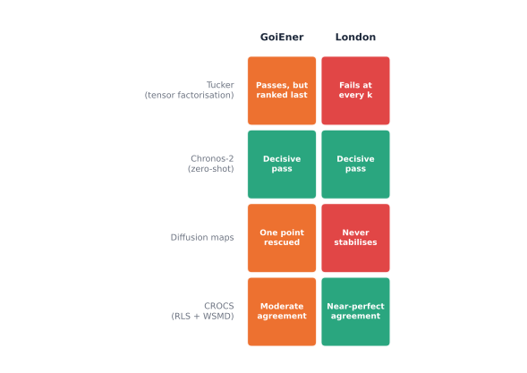

Chapter 1 closed with a promise, stated plainly rather than tucked into a
footnote: later chapters would test whether the settled recipe, together
with four different data representations, a two-stage summary of
behaviour, tensor decomposition, a learned foundation-model embedding, and
a diffusion-map perspective, produces consistent definitions of real
structure across independent populations, including households in London
and Spain. That is not a hypothetical. It is what this chapter checks,
against real GoiEner and London households, using the same trust-gated
composite score Chapter 2 built and Chapter 3 already relies on, not a
fresh, more forgiving standard invented for the occasion.

The standard way a new representation earns its place in this
literature is familiar: propose it, show it beats a baseline on one
dataset, publish. That approach quietly assumes a representation's own
apparent success on one population is evidence of something real and
transferable, not a coincidence of that population's own quirks. Chapter
1's own review already found this gap directly: not one of Tucker
decomposition, diffusion maps, a learned zero-shot embedding, or CROCS's
own two-stage design has been checked against a second, independently
collected population, in this literature or in this book, until now.
Checked honestly, four real questions follow, and together they are this
chapter's own structure. Does each representation find genuinely
trustworthy structure at all, on either population, once judged by the
same resampling standard as everything else in this part? When it does,
does it agree with what the settled recipe already found, or does it
reveal something the settled recipe cannot see? Does a finding on one
population survive contact with a second, or is it an idiosyncrasy that
does not travel? And after checking all four, honestly, does the settled
`shape`+PaCMAP+GMM recipe remain the strongest known option, or does a
real alternative earn a place beside it?

## Borrow, do not invent

Every mechanism this chapter reaches for is a real, published method,
already named and formally introduced in Chapter 1, restated here in
miniature rather than re-derived from scratch. Tucker's three-way
factorisation approximates a genuine households-by-days-by-time-of-day
tensor $\mathcal{X} \in \mathbb{R}^{I \times J \times K}$ as a smaller
core tensor and one factor matrix per mode, $\mathcal{X} \approx
\mathcal{G} \times_1 A \times_2 B \times_3 C$ [@tucker1966threemode]; the
household-mode factor matrix $A$ is the low-dimensional embedding
clustered on below. Coifman and Lafon's diffusion maps build a Markov
transition matrix $P = D^{-1}W$ from a kernel similarity and embed each
point by its top eigenvectors scaled by eigenvalue, $\Psi_t(i) =
(\lambda_1^t \psi_1(i), \lambda_2^t \psi_2(i), \dots)$, reading the
eigenvalue spectrum itself for a real gap before trusting any resulting
partition [@coifmanlafon2006diffusionmaps]. Yerbury et al.'s CROCS
summarises each household's own days into a small Representative Load
Set, then compares households by a Weighted Sum of Minimum Distances
between their own RLSs, crediting a match by how often each
representative shape actually occurs, not just whether the single
closest pair happens to align [@yerbury2026crocs]. Chronos-2, already
validated in this book's own foundation-model forecasting chapter, runs
each household's own real sequence through a pretrained encoder with no
fitting step at all and returns one embedding vector per input patch,
mean-pooled here into a single per-household vector
[@ansari2025chronos2].

## The reference point

Before checking anything new, this chapter re-anchors on what is already
known. Chapter 2 settled `shape`+PaCMAP+GMM on London; Chapter 3 already
extended the same no-reduction convention to GoiEner directly, settling
on its own real $K=4$ there. This chapter's own baseline rerun of that
same peak-normalised, no-reduction pipeline on 2,000 real GoiEner
households, run independently for this comparison, reconfirms the
broader shape of that finding rather than one fixed number: $k{=}2$,
$k{=}3$, and $k{=}4$ all clear the real trust gate, prediction strength
0.839, 0.728, and 0.719 respectively, minimum cluster stability 0.937,
0.881, and 0.796, a genuine landscape rather than one winner, the same
honest shape of result Chapter 2 already found for London's own richer
resolutions.



That landscape, not a single number, is the real baseline every
representation below gets checked against.

## Tucker tensor decomposition

Raw Tucker decomposition, with no correction for a household's own
scale, fails on both real populations, and fails the same way. On
GoiEner, its own household-mode factors turn out to correlate directly
with each household's raw peak consumption, so Euclidean k-means ends up
isolating the household with the most extreme peak at each $k$, not
finding real archetypes; the real trust gate confirms it, prediction
strength 0.998 (trivial for a split this lopsided) against a
cluster-wise stability of only 0.47, deep in Hennig's dissolved band. On
London the same mechanism recurs, a suspiciously high silhouette at
$k{=}2$ (0.813) collapsing sharply by $k{=}4$, and the trust gate again
refuses it: prediction strength 0.96, stability just 0.177.





Peak-normalising each household's own season before decomposing, this
book's own magnitude-invariance convention, is where the two populations
genuinely part ways. On GoiEner it produces a real, trustworthy $k{=}2$
split, 1,960 households against 40, prediction strength 0.976, minimum
cluster stability 0.858, as trustworthy on paper as anything found
anywhere in this book. Yet the trust-gated composite score ranks it
*last* of the four $k$ values checked, purely because its own balance,
0.141, is the lowest of the four, a real, concrete limit in a scoring
rule that takes the minimum of balance and stability: it has no way to
tell a genuinely rare, resampling-stable archetype from a fake one, and
vetoes both alike.



On London, peak-normalising does not rescue the representation at all.
Every $k$ from 2 to 5 fails to clear Tibshirani and Walther's own 0.8
prediction-strength floor from $k{=}3$ onward, and stability never
exceeds 0.384. Part of the reason is structural, not procedural: London's
half-hourly households compress far less cleanly than GoiEner's hourly
ones, reaching only 51% explained variance at the largest household rank
tried, against GoiEner's 99% at a fifth of that rank. A finer real
sampling rate carries finer real behavioural variation a low-rank
household factor struggles to summarise.



A related, cautionary finding belongs here too, even though it sits
outside Chapter 1's own four named representations. A separate check on
GoiEner, clustering directly on 850 raw multi-resolution feature
columns with no dimensionality reduction at all, produced a silhouette
of 0.990, higher than anything else in this whole comparison, and a
split of 1,999 households against 1. Cluster-wise stability read 0.829,
inside Hennig's own stable band, not below it: the single extreme
household sits so far from everyone else in that high-dimensional space
that a bootstrap resample reliably rediscovers it as its own cluster
regardless of composition, extremeness itself fooling a check built to
catch instability. Only the balance score, 0.006, close to the floor,
caught what stability could not.



Tucker's own real lesson, then, is not "Tucker fails" or "Tucker
succeeds." Its by-construction dimensionality reduction avoids the
multi-resolution notebook's own curse-of-dimensionality trap, but a
magnitude correction it does not apply automatically is doing most of
the real work, and even once applied, whether the result is trustworthy
depends on the population, decisively yes on GoiEner, decisively no on
London, at the ranks checked here.

## Chronos-2 zero-shot embeddings

Every other representation in this chapter needs some hand-designed
correction, a peak normalisation, a rank choice, a season split, before
it clusters cleanly. Chronos-2 needs none of it. Fed each household's own
real, unaveraged summer sequence directly, with no fitting step on this
data at all, its own embedding is naturally low-rank on both
populations: PCA needs only 28 of 768 raw dimensions for 90% explained
variance on GoiEner, 34 on London.

On GoiEner, the resulting $k{=}2$ splits 591 households against 1,409,
and clears the real trust gate decisively: prediction strength 0.849,
minimum cluster stability 0.928. On London, $k{=}2$ splits a
near-even 654 against 630, balance 1.000, and clears the same gate more
decisively still, prediction strength 0.891, stability 0.955. Every
other $k$ checked on either population, 3 through 5 or 9, fails the real
resampling floor outright.





This is the one representation in the whole comparison that clears the
same real bar independently on both populations, the headline finding of
this chapter. It is not, however, the same finding twice. GoiEner's own
591-household group is a real minority; London's own 654-630 split is
close to even, the most balanced result any representation in this
comparison finds on London, including the settled recipe's own 982-302
split. Chronos-2's zero-shot embedding is not rediscovering the settled
recipe's own archetypes through a different lens. It is finding a
genuinely different, equally real axis of behaviour, coarser on GoiEner,
markedly more even on London, that a hand-engineered peak-normalised
shape does not surface.

## Diffusion maps

Diffusion maps ask a sharper question than a silhouette curve can: read
the eigenvalue spectrum of a real random-walk kernel directly, and check
whether a genuine gap separates a small number of real clusters from a
continuum, before ever fitting $k$. Run here on top of both the Tucker
and Chronos-2 embeddings above, on both populations, the answer is not a
clean yes or no, and reporting that honestly matters more than forcing
one.

On GoiEner, Tucker diffusion's own validity curve is suspiciously high
and nearly flat (0.978-0.982) across most $k$, the same magnitude-driven
warning sign raw Tucker itself showed, isolating a single household at
the curve's own favoured $k$. But its own $k{=}2$, a different operating
point, actually clears the real trust gate: prediction strength 0.833,
stability 0.805. GoiEner's own Chronos-2 diffusion runs the opposite way,
degrading an already-trustworthy raw embedding into one that fails
cluster-wise stability at every $k$ checked (a best of 0.356, still
inside the dissolved band).





London sharpens both halves of that same story. Tucker diffusion never
reaches a stable point at any $k$ from 2 to 4, stability topping out at
0.61, well short of GoiEner's own rescued 0.805. Chronos-2 diffusion
degrades London's own decisively balanced raw embedding even more
sharply than it degraded GoiEner's, cluster-wise stability collapsing
from 0.955 in the raw embedding to 0.211 once diffused.





The consistent, cross-population lesson is narrower than "diffusion maps
do not work here." A spectral-gap check is only as good as the geometry
it runs on, and applying one on top of an embedding that is already good
is not free: on both populations checked, Chronos-2's own already-trust
worthy structure got worse, never better, under a diffusion transform.
Whether a diffusion map helps or actively destroys real structure has to
be checked case by case, not assumed either way, a genuinely different,
more cautionary lesson than the one this chapter's other three
representations teach.

## CROCS-inspired two-stage clustering

CROCS keeps each real household's own distinct daily behaviours
separate, comparing households only at the level of how much their own
typical days resemble each other's, rather than collapsing a whole
season into one blended average first. On both populations, most
households show genuine within-season diversity: on GoiEner, only 25 of
2,000 collapse to a single representative day-type; on London, only 1 of
1,284 does, with a mean of 2.53 real day-types per household.

Where the two populations diverge is in how confidently that structure
replicates. On GoiEner, the chosen $k{=}2$ isolates a real, tight
minority of 9 households against 1,991, but repeated 80% subsampling
finds only moderate agreement, mean  0.527 across 105
independent pairs, with the weakest pair essentially at chance,
$-0.022$. On London, the chosen $k{=}2$ isolates an even more extreme
minority, 3 households against 1,281, and the same resampling check
finds it reproduces almost perfectly, mean  1.000 across
every one of the same 105 pairs.





The qualitative finding, a small, tight minority genuinely separating
from the bulk under a per-household representative-day distance, holds
on both real populations. How much confidence the resampling check
itself warrants in that finding does not: rock-solid on London, real but
markedly more provisional on GoiEner. A representation that finds the
same *kind* of structure everywhere is not automatically finding it with
the same *reliability* everywhere, and this chapter's own trust gate is
what makes that distinction visible instead of papering over it with one
silhouette number.

## Where this leaves the settled recipe

{#fig-cross-population-trust-gate}

| Representation | GoiEner | London |
|---|---|---|
| Tucker (peak-normalised) | Passes ($k{=}2$, PS 0.976, stability 0.858), but ranked last on composite balance | Fails at every $k$ (best stability 0.384) |
| Chronos-2 (zero-shot) | Decisive pass ($k{=}2$, PS 0.849, stability 0.928) | Decisive pass ($k{=}2$, PS 0.891, stability 0.955) |
| Diffusion maps | Mixed: Tucker-diffusion rescues one point (0.805); Chronos-2-diffusion fails everywhere | Fails: Tucker-diffusion never stabilises (0.61); Chronos-2-diffusion collapses to 0.211 |
| CROCS (RLS + WSMD) | Real minority (9/2,000), moderate resampling agreement (mean  0.527) | Real minority (3/1,284), near-perfect resampling agreement (mean  1.000) |

Four real questions opened this chapter. Checked honestly against both
populations, the answers are not uniform, and that unevenness is itself
the finding worth keeping. Every representation finds *some* real
structure somewhere; only Chronos-2 finds structure that clears the same
resampling bar independently on both real populations checked. Tucker's
own success is real but population-specific. Diffusion maps, on both
populations, more often destroy a good embedding's own trustworthiness
than improve it. CROCS finds the same kind of structure on both
populations but not with the same reliability.

Does the settled `shape`+PaCMAP+GMM recipe remain the strongest known
option? Yes, on the evidence checked here. It carries the longest,
broadest validation in this book, three independent real utilities, not
two, and the most consistent resampling record across all of them. But
Chronos-2's zero-shot embedding earns a real, disclosed place alongside
it, the one alternative representation in this whole comparison whose
own trustworthy structure survives contact with a second, independently
collected population intact. It does not replace the settled recipe. It
finds a genuinely different, equally real axis of behaviour the settled
recipe's own hand-engineered shape feature does not surface, worth a
second look whenever a use case wants a representation with no
hand-engineering step and can tolerate whatever coarser or more even
split a pretrained encoder happens to find. Tucker, diffusion maps, and
CROCS remain real, useful findings on their own narrower terms, not yet
alternatives to the recipe itself.
